# ze-benchmarks Architecture Documentation

## Table of Contents
1. [Overview](#overview)
2. [Architecture Transformation](#architecture-transformation)
3. [System Architecture](#system-architecture)
4. [Data Flow](#data-flow)
5. [Component Details](#component-details)
6. [Database Schema](#database-schema)
7. [API Architecture](#api-architecture)
8. [Local Development](#local-development)
9. [Production Deployment](#production-deployment)
10. [Technology Stack](#technology-stack)
11. [Worker Development Guide](#worker-development-guide)
12. [Performance Bottlenecks](#performance-bottlenecks)

---

## Overview

The ze-benchmarks system is a comprehensive benchmark harness and reporting platform for evaluating AI agent performance. The system uses a **API-driven architecture** with Cloudflare Workers and D1 database, providing a scalable, globally-distributed platform for running and analyzing benchmarks.

### Key Design Principles

- **API-First**: All data flows through RESTful Worker API
- **Globally Distributed**: Edge deployment via Cloudflare Workers
- **Type Safety**: End-to-end TypeScript across CLI, Worker, and Frontend
- **Developer Experience**: Simple local development with wrangler
- **Cloud-Native**: D1 database for serverless SQLite at scale
- **Multi-Environment**: Support for local, dev, staging, and production environments

---

## Current Architecture

### API-Driven Architecture

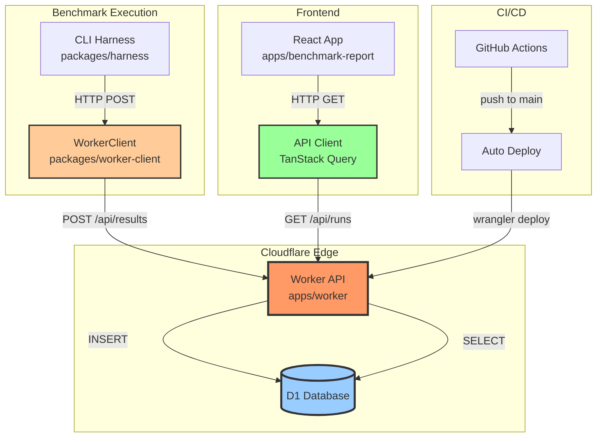
```mermaid
graph TB
    subgraph "Benchmark Execution"
        CLI[CLI Harness<br/>packages/harness]
        LOGGER[WorkerClient<br/>packages/worker-client]
    end

    subgraph "Cloudflare Edge"
        WORKER[Worker API<br/>apps/worker]
        D1[(D1 Database)]
    end

    subgraph "Frontend"
        REACT[React App<br/>apps/benchmark-report]
        APICLIENT[API Client<br/>TanStack Query]
    end

    subgraph "CI/CD"
        GHA[GitHub Actions]
        DEPLOY[Auto Deploy]
    end

    CLI -->|HTTP POST| LOGGER
    LOGGER -->|POST /api/results| WORKER
    WORKER -->|INSERT| D1

    REACT -->|HTTP GET| APICLIENT
    APICLIENT -->|GET /api/runs| WORKER
    WORKER -->|SELECT| D1

    GHA -->|push to main| DEPLOY
    DEPLOY -->|wrangler deploy| WORKER

    style WORKER fill:#f96,stroke:#333,stroke-width:3px
    style D1 fill:#9cf,stroke:#333,stroke-width:3px
    style LOGGER fill:#fc9,stroke:#333,stroke-width:2px
    style APICLIENT fill:#9f9,stroke:#333,stroke-width:2px
```

**Current Architecture Benefits:**
- **API-First**: All data flows through RESTful Worker API
- **Real-Time Updates**: Frontend fetches latest data from Worker
- **Globally Distributed**: Edge deployment via Cloudflare Workers
- **Auto-Scaling**: Workers scale automatically with traffic
- **Multi-Environment**: Local, dev, staging, and production environments
- **Type-Safe**: End-to-end TypeScript with shared types

---

## System Architecture

### High-Level Component View

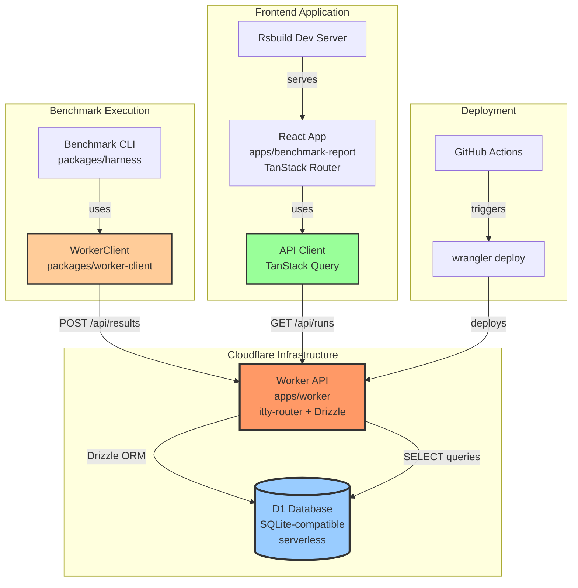
```mermaid
graph TB
    subgraph "Benchmark Execution"
        CLI[Benchmark CLI<br/>packages/harness]
        LOGGER[WorkerClient<br/>packages/worker-client]
    end

    subgraph "Cloudflare Infrastructure"
        WORKER[Worker API<br/>apps/worker<br/>itty-router + Drizzle]
        D1[(D1 Database<br/>SQLite-compatible<br/>serverless)]
    end

    subgraph "Frontend Application"
        REACT[React App<br/>apps/benchmark-report<br/>TanStack Router]
        APICLIENT[API Client<br/>TanStack Query]
        RSBUILD[Rsbuild Dev Server]
    end

    subgraph "Deployment"
        GHA[GitHub Actions]
        WRANGLER[wrangler deploy]
    end

    CLI -->|uses| LOGGER
    LOGGER -->|POST /api/results| WORKER
    WORKER -->|Drizzle ORM| D1

    RSBUILD -->|serves| REACT
    REACT -->|uses| APICLIENT
    APICLIENT -->|GET /api/runs| WORKER
    WORKER -->|SELECT queries| D1

    GHA -->|triggers| WRANGLER
    WRANGLER -->|deploys| WORKER

    style WORKER fill:#f96,stroke:#333,stroke-width:3px
    style D1 fill:#9cf,stroke:#333,stroke-width:3px
    style APICLIENT fill:#9f9,stroke:#333,stroke-width:2px
    style LOGGER fill:#fc9,stroke:#333,stroke-width:2px
```

### Architecture Layers

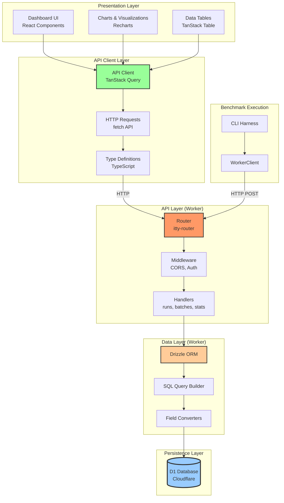
```mermaid
graph TB
    subgraph "Presentation Layer"
        A1[Dashboard UI<br/>React Components]
        A2[Charts & Visualizations<br/>Recharts]
        A3[Data Tables<br/>TanStack Table]
    end

    subgraph "API Client Layer"
        B1[API Client<br/>TanStack Query]
        B2[HTTP Requests<br/>fetch API]
        B3[Type Definitions<br/>TypeScript]
    end

    subgraph "API Layer (Worker)"
        C1[Router<br/>itty-router]
        C2[Middleware<br/>CORS, Auth]
        C3[Handlers<br/>runs, batches, stats]
    end

    subgraph "Data Layer (Worker)"
        D1[Drizzle ORM]
        D2[SQL Query Builder]
        D3[Field Converters]
    end

    subgraph "Persistence Layer"
        E1[(D1 Database<br/>Cloudflare)]
    end

    subgraph "Benchmark Execution"
        F1[CLI Harness]
        F2[WorkerClient]
    end

    A1 --> B1
    A2 --> B1
    A3 --> B1
    B1 --> B2
    B2 --> B3
    B3 -->|HTTP| C1

    C1 --> C2
    C2 --> C3
    C3 --> D1
    D1 --> D2
    D2 --> D3
    D3 --> E1

    F1 --> F2
    F2 -->|HTTP POST| C1

    style B1 fill:#9f9,stroke:#333,stroke-width:2px
    style C1 fill:#f96,stroke:#333,stroke-width:2px
    style D1 fill:#fc9,stroke:#333,stroke-width:2px
    style E1 fill:#9cf,stroke:#333,stroke-width:3px
```

---

## Data Flow

### Complete Benchmark Run Flow

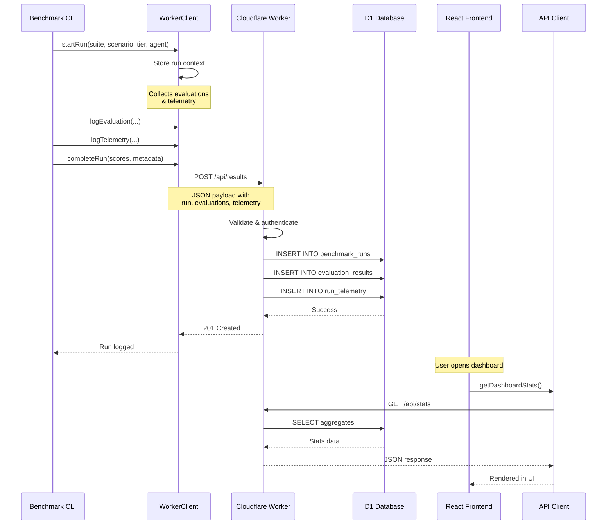
```mermaid
sequenceDiagram
    participant CLI as Benchmark CLI
    participant WC as WorkerClient
    participant Worker as Cloudflare Worker
    participant D1 as D1 Database
    participant Frontend as React Frontend
    participant API as API Client

    CLI->>WC: startRun(suite, scenario, tier, agent)
    WC->>WC: Store run context
    Note over WC: Collects evaluations<br/>& telemetry
    CLI->>WC: logEvaluation(...)
    CLI->>WC: logTelemetry(...)
    CLI->>WC: completeRun(scores, metadata)

    WC->>Worker: POST /api/results
    Note over WC,Worker: JSON payload with<br/>run, evaluations, telemetry
    Worker->>Worker: Validate & authenticate
    Worker->>D1: INSERT INTO benchmark_runs
    Worker->>D1: INSERT INTO evaluation_results
    Worker->>D1: INSERT INTO run_telemetry
    D1-->>Worker: Success
    Worker-->>WC: 201 Created
    WC-->>CLI: Run logged

    Note over Frontend: User opens dashboard
    Frontend->>API: getDashboardStats()
    API->>Worker: GET /api/stats
    Worker->>D1: SELECT aggregates
    D1-->>Worker: Stats data
    Worker-->>API: JSON response
    API-->>Frontend: Rendered in UI
```

### Local Development Data Flow

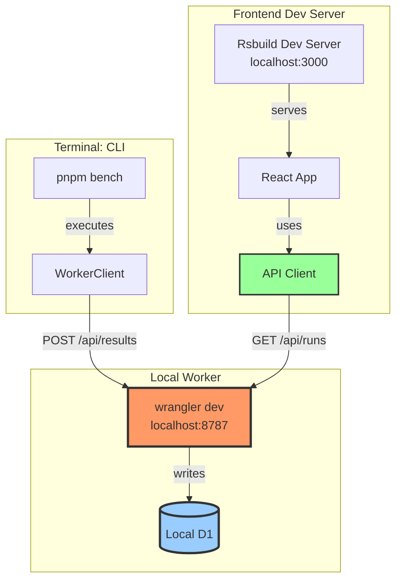
```mermaid
graph TB
    subgraph "Terminal: CLI"
        C[pnpm bench]
        WC[WorkerClient]
    end

    subgraph "Local Worker"
        WORKER[wrangler dev<br/>localhost:8787]
        D1[(Local D1)]
    end

    subgraph "Frontend Dev Server"
        RS[Rsbuild Dev Server<br/>localhost:3000]
        REACT[React App]
        API[API Client]
    end

    C -->|executes| WC
    WC -->|POST /api/results| WORKER
    WORKER -->|writes| D1
    RS -->|serves| REACT
    REACT -->|uses| API
    API -->|GET /api/runs| WORKER

    style WORKER fill:#f96,stroke:#333,stroke-width:3px
    style D1 fill:#9cf,stroke:#333,stroke-width:3px
    style API fill:#9f9,stroke:#333,stroke-width:2px
```

### Multi-Environment Deployment Flow

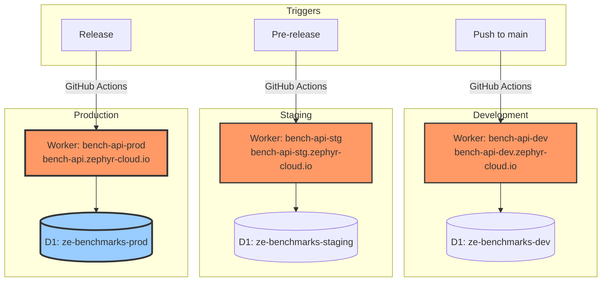
```mermaid
graph TB
    subgraph "Development"
        DEVWORKER[Worker: bench-api-dev<br/>bench-api-dev.zephyr-cloud.io]
        DEVD1[(D1: ze-benchmarks-dev)]
    end

    subgraph "Staging"
        STGWORKER[Worker: bench-api-stg<br/>bench-api-stg.zephyr-cloud.io]
        STGD1[(D1: ze-benchmarks-staging)]
    end

    subgraph "Production"
        PRODWORKER[Worker: bench-api-prod<br/>bench-api.zephyr-cloud.io]
        PRODD1[(D1: ze-benchmarks-prod)]
    end

    subgraph "Triggers"
        MAINPUSH[Push to main]
        PRERELEASE[Pre-release]
        RELEASE[Release]
    end

    MAINPUSH -->|GitHub Actions| DEVWORKER
    PRERELEASE -->|GitHub Actions| STGWORKER
    RELEASE -->|GitHub Actions| PRODWORKER

    DEVWORKER --> DEVD1
    STGWORKER --> STGD1
    PRODWORKER --> PRODD1

    style DEVWORKER fill:#f96,stroke:#333,stroke-width:2px
    style STGWORKER fill:#f96,stroke:#333,stroke-width:2px
    style PRODWORKER fill:#f96,stroke:#333,stroke-width:3px
    style PRODD1 fill:#9cf,stroke:#333,stroke-width:3px
```

---

## Component Details

### 1. CLI Worker Client

**Location**: `packages/worker-client/src/logger.ts`

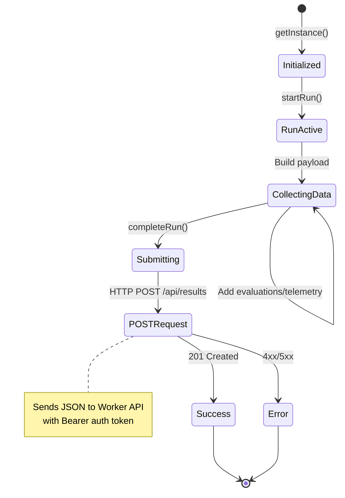
```mermaid
stateDiagram-v2
    [*] --> Initialized: getInstance()
    Initialized --> RunActive: startRun()
    RunActive --> CollectingData: Build payload
    CollectingData --> CollectingData: Add evaluations/telemetry
    CollectingData --> Submitting: completeRun()
    Submitting --> POSTRequest: HTTP POST /api/results
    POSTRequest --> Success: 201 Created
    POSTRequest --> Error: 4xx/5xx
    Success --> [*]
    Error --> [*]

    note right of POSTRequest
        Sends JSON to Worker API
        with Bearer auth token
    end note
```

**Key Features**:
- Drop-in replacement for local BenchmarkLogger
- In-memory accumulation of run data
- HTTP POST to Worker API
- Bearer token authentication
- Automatic retry on failure
- Type-safe API payloads

**Key Files**:
- `logger.ts`: BenchmarkLogger class (Worker-based)
- `client.ts`: WorkerClient for HTTP requests
- `types.ts`: TypeScript type definitions

### 2. Cloudflare Worker API

**Location**: `apps/worker/src/`

The Worker API is built with itty-router and Drizzle ORM, deployed to Cloudflare's global edge network.

**Key Components**:
1. **Router** (`index.ts`): Request routing with itty-router
2. **Middleware**: CORS, authentication, error handling
3. **API Handlers**:
   - `api/runs.ts`: Benchmark run endpoints
   - `api/batches.ts`: Batch management endpoints
   - `api/stats.ts`: Statistics and aggregations
   - `api/submit.ts`: Data ingestion endpoints
4. **Database**: Drizzle ORM with D1

**Database Schema** (`src/db/schema.ts`):
1. `batch_runs`: Batch-level aggregations
2. `benchmark_runs`: Individual benchmark run records
3. `evaluation_results`: Evaluator scores for each run
4. `run_telemetry`: Token usage, cost, duration metrics

**Indexes** (for query performance):
- Suite + Scenario combination
- Agent lookup
- Status filtering
- Batch ID relationships
- Success flag filtering

**Environments**:
- **Local**: `http://localhost:8787` (wrangler dev)
- **Development**: `https://bench-api-dev.zephyr-cloud.io`
- **Staging**: `https://bench-api-stg.zephyr-cloud.io`
- **Production**: `https://bench-api.zephyr-cloud.io`

### 3. Frontend Architecture

**Location**: `apps/benchmark-report/src/`

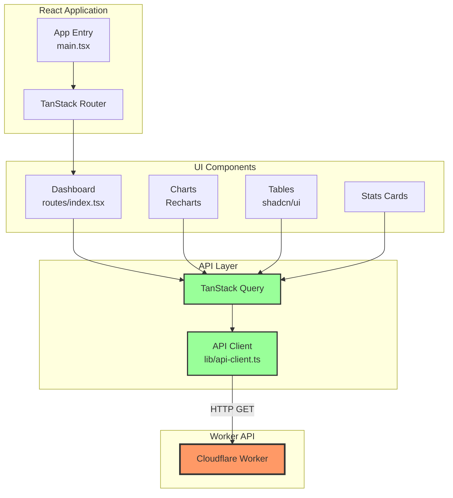
```mermaid
graph TB
    subgraph "React Application"
        A[App Entry<br/>main.tsx]
        B[TanStack Router]
    end

    subgraph "API Layer"
        C[API Client<br/>lib/api-client.ts]
        D[TanStack Query]
    end

    subgraph "UI Components"
        H1[Dashboard<br/>routes/index.tsx]
        H2[Charts<br/>Recharts]
        H3[Tables<br/>shadcn/ui]
        H4[Stats Cards]
    end

    subgraph "Worker API"
        W[Cloudflare Worker]
    end

    A --> B
    B --> H1
    H1 --> D
    H2 --> D
    H3 --> D
    H4 --> D
    D --> C
    C -->|HTTP GET| W

    style C fill:#9f9,stroke:#333,stroke-width:2px
    style D fill:#9f9,stroke:#333,stroke-width:2px
    style W fill:#f96,stroke:#333,stroke-width:3px
```

**Key Files**:
- `lib/api-client.ts`: API client with TypeScript types
- `routes/*.tsx`: Page components using TanStack Router
- `components/ui/*`: Reusable UI components (shadcn/ui)
- `rsbuild.config.ts`: Rsbuild configuration

**Data Access Strategy**:
- HTTP requests via API Client
- TanStack Query for caching and state management
- Automatic background refetching
- Optimistic updates
- Manual refresh capability
- Real-time data from Worker API

### 4. Deployment Pipeline

**GitHub Actions Workflows**:

1. **deploy-worker-dev.yml**: Auto-deploy to development
   - Trigger: Push to `main` branch
   - Target: Development environment (`bench-api-dev.zephyr-cloud.io`)
   - Runs migrations automatically
   - Fast feedback loop for testing

2. **deploy-worker-release.yml**: Deploy to staging/production
   - Trigger: GitHub releases (pre-release → staging, release → production)
   - Target: Staging (`bench-api-stg.zephyr-cloud.io`) or Production (`bench-api.zephyr-cloud.io`)
   - Runs migrations automatically
   - Manual approval gates (GitHub environments)

**Deployment Steps**:
1. Build worker dependencies (`pnpm build`)
2. Deploy worker (`wrangler deploy --env <environment>`)
3. Apply D1 migrations (`wrangler d1 migrations apply`)
4. Verify deployment (health check)

**Required Secrets**:
- `CLOUDFLARE_API_TOKEN`: API token for Cloudflare
- `CLOUDFLARE_ACCOUNT_ID`: Cloudflare account ID

---

## Database Schema

### Entity Relationship Diagram

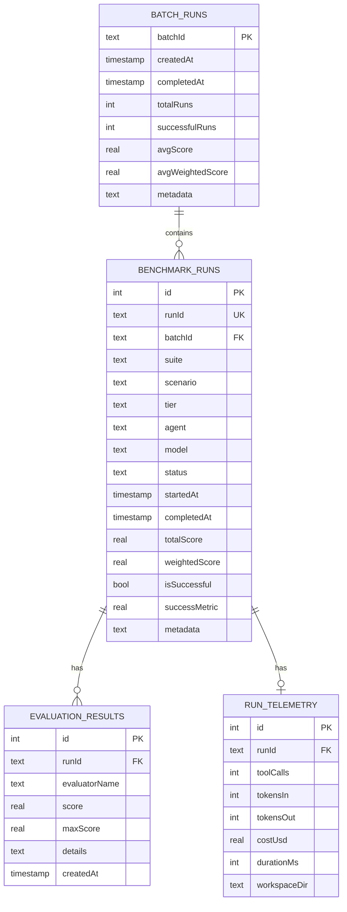
```mermaid
erDiagram
    BATCH_RUNS ||--o{ BENCHMARK_RUNS : contains
    BENCHMARK_RUNS ||--o{ EVALUATION_RESULTS : has
    BENCHMARK_RUNS ||--o| RUN_TELEMETRY : has

    BATCH_RUNS {
        text batchId PK
        timestamp createdAt
        timestamp completedAt
        int totalRuns
        int successfulRuns
        real avgScore
        real avgWeightedScore
        text metadata
    }

    BENCHMARK_RUNS {
        int id PK
        text runId UK
        text batchId FK
        text suite
        text scenario
        text tier
        text agent
        text model
        text status
        timestamp startedAt
        timestamp completedAt
        real totalScore
        real weightedScore
        bool isSuccessful
        real successMetric
        text metadata
    }

    EVALUATION_RESULTS {
        int id PK
        text runId FK
        text evaluatorName
        real score
        real maxScore
        text details
        timestamp createdAt
    }

    RUN_TELEMETRY {
        int id PK
        text runId FK
        int toolCalls
        int tokensIn
        int tokensOut
        real costUsd
        int durationMs
        text workspaceDir
    }
```

### Schema Design Principles

1. **Normalization**: Separate tables for runs, evaluations, and telemetry
2. **Batch Grouping**: Aggregate multiple runs into logical batches
3. **Performance Indexes**: Strategic indexes on frequently queried columns
4. **Type Safety**: Drizzle ORM ensures compile-time type checking
5. **Flexibility**: JSON metadata fields for extensibility

---

## API Architecture

### Endpoint Map

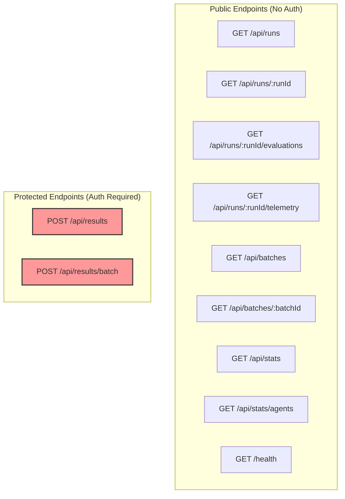
```mermaid
graph TB
    subgraph "Public Endpoints (No Auth)"
        R1[GET /api/runs]
        R2[GET /api/runs/:runId]
        R3[GET /api/runs/:runId/evaluations]
        R4[GET /api/runs/:runId/telemetry]

        B1[GET /api/batches]
        B2[GET /api/batches/:batchId]

        S1[GET /api/stats]
        S2[GET /api/stats/agents]

        H[GET /health]
    end

    subgraph "Protected Endpoints (Auth Required)"
        W1[POST /api/results]
        W2[POST /api/results/batch]
    end

    style W1 fill:#f99,stroke:#333,stroke-width:2px
    style W2 fill:#f99,stroke:#333,stroke-width:2px
```

### API Request Flow

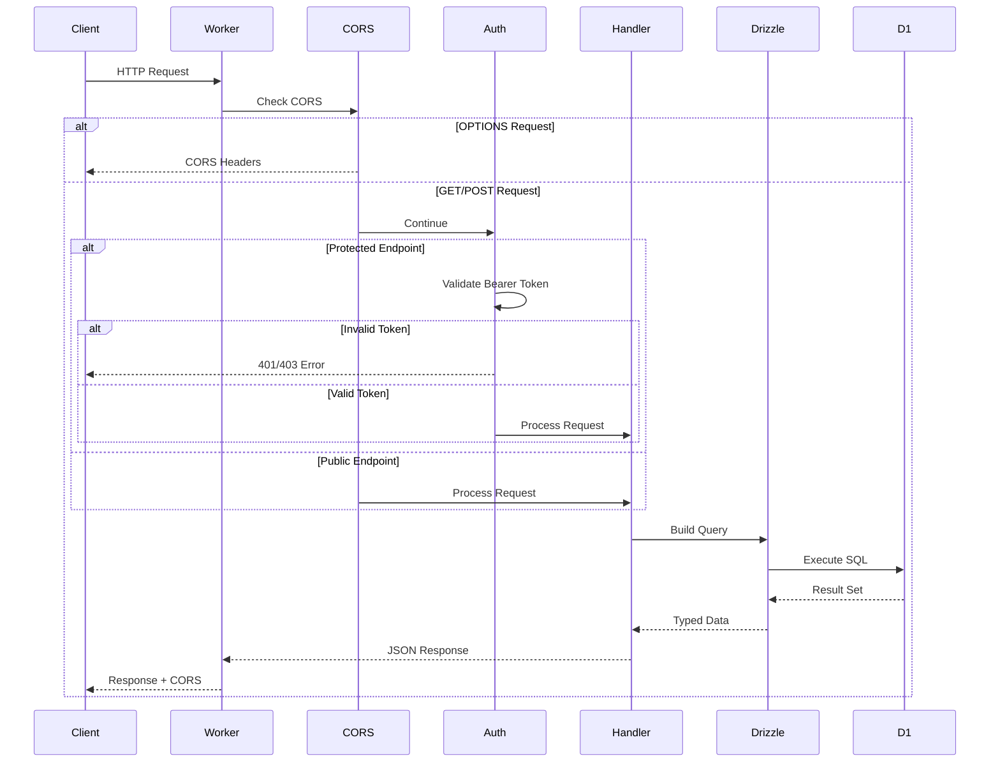
```mermaid
sequenceDiagram
    participant Client
    participant Worker
    participant CORS
    participant Auth
    participant Handler
    participant Drizzle
    participant D1

    Client->>Worker: HTTP Request
    Worker->>CORS: Check CORS

    alt OPTIONS Request
        CORS-->>Client: CORS Headers
    else GET/POST Request
        CORS->>Auth: Continue

        alt Protected Endpoint
            Auth->>Auth: Validate Bearer Token
            alt Invalid Token
                Auth-->>Client: 401/403 Error
            else Valid Token
                Auth->>Handler: Process Request
            end
        else Public Endpoint
            CORS->>Handler: Process Request
        end

        Handler->>Drizzle: Build Query
        Drizzle->>D1: Execute SQL
        D1-->>Drizzle: Result Set
        Drizzle-->>Handler: Typed Data
        Handler-->>Worker: JSON Response
        Worker-->>Client: Response + CORS
    end
```

### Authentication Flow

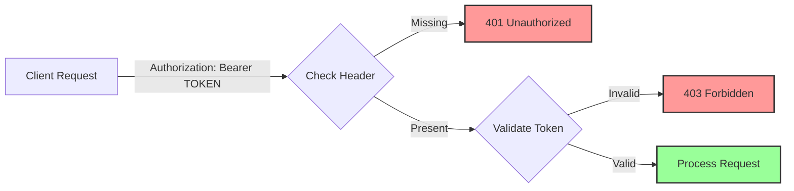
```mermaid
graph LR
    A[Client Request] -->|Authorization: Bearer TOKEN| B{Check Header}
    B -->|Missing| C[401 Unauthorized]
    B -->|Present| D{Validate Token}
    D -->|Invalid| E[403 Forbidden]
    D -->|Valid| F[Process Request]

    style C fill:#f99,stroke:#333,stroke-width:2px
    style E fill:#f99,stroke:#333,stroke-width:2px
    style F fill:#9f9,stroke:#333,stroke-width:2px
```

**Authentication Details**:
- Bearer token authentication for POST endpoints
- Token stored in Worker secret: `API_SECRET_KEY`
- CLI uses environment variable: `ZE_BENCHMARKS_API_KEY`
- Simple string comparison (no JWT complexity needed)
- Local dev uses `dev-local-key` for convenience

---

## Local Development

### mprocs Orchestration

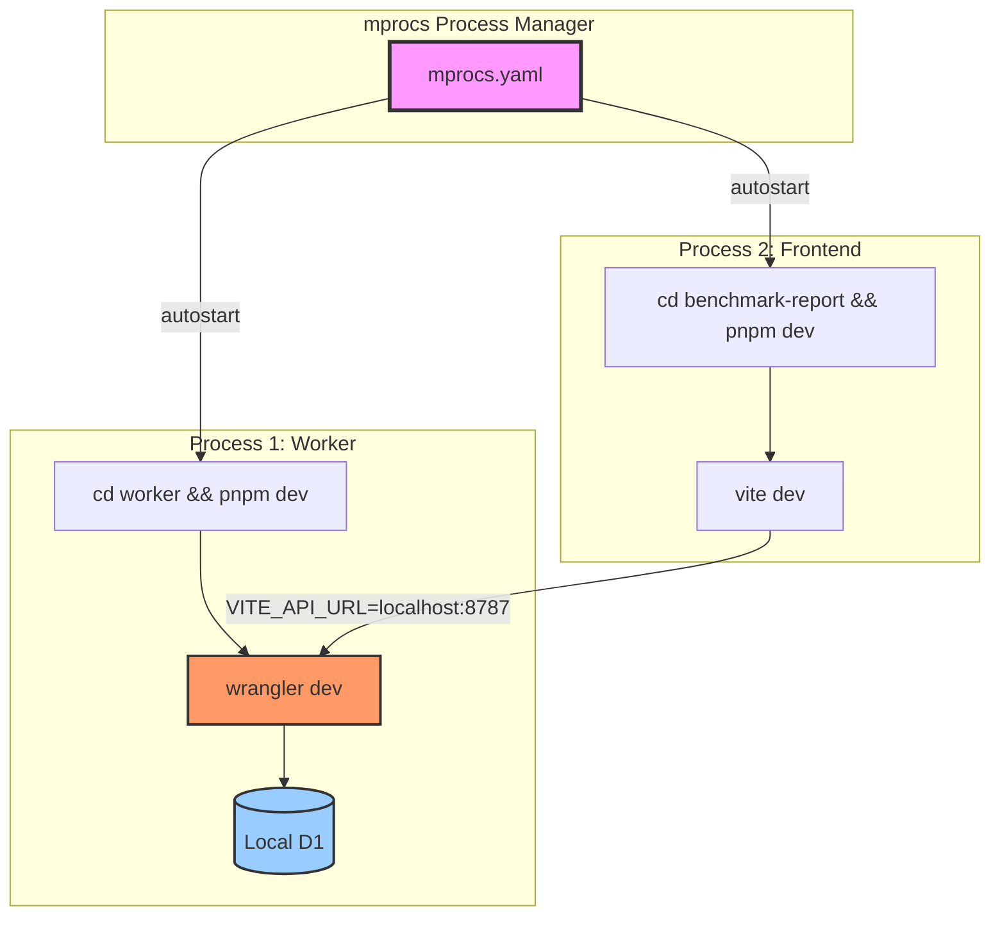
```mermaid
graph TB
    subgraph "mprocs Process Manager"
        M[mprocs.yaml]
    end

    subgraph "Process 1: Worker"
        P1[cd worker && pnpm dev]
        W[wrangler dev]
        D1[(Local D1)]
        P1 --> W
        W --> D1
    end

    subgraph "Process 2: Frontend"
        P2[cd benchmark-report && pnpm dev]
        V[vite dev]
        P2 --> V
    end

    M -->|autostart| P1
    M -->|autostart| P2

    V -->|VITE_API_URL=localhost:8787| W

    style M fill:#f9f,stroke:#333,stroke-width:3px
    style W fill:#f96,stroke:#333,stroke-width:2px
    style D1 fill:#9cf,stroke:#333,stroke-width:2px
```

**mprocs Configuration** (`mprocs.yaml`):
```yaml
procs:
  worker:
    cmd: cd worker && pnpm dev
    autostart: true
  frontend:
    cmd: cd benchmark-report && pnpm dev
    autostart: true
    env:
      VITE_API_URL: http://localhost:8787
```

### Development Workflow

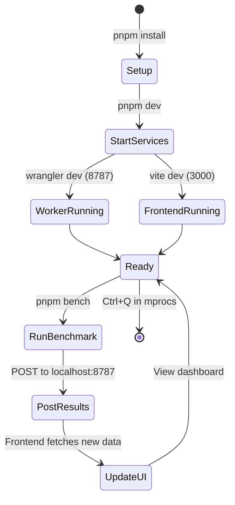
```mermaid
stateDiagram-v2
    [*] --> Setup: pnpm install
    Setup --> StartServices: pnpm dev
    StartServices --> WorkerRunning: wrangler dev (8787)
    StartServices --> FrontendRunning: vite dev (3000)
    WorkerRunning --> Ready
    FrontendRunning --> Ready
    Ready --> RunBenchmark: pnpm bench
    RunBenchmark --> PostResults: POST to localhost:8787
    PostResults --> UpdateUI: Frontend fetches new data
    UpdateUI --> Ready: View dashboard
    Ready --> [*]: Ctrl+Q in mprocs
```

**Commands**:
```bash
# Initial setup
pnpm install
cd worker && pnpm install

# Create local D1 database
cd worker
wrangler d1 create ze-benchmarks
pnpm db:generate
pnpm db:push:local

# Start all services
cd ..
pnpm dev

# In another terminal - run benchmarks
export ZE_BENCHMARKS_WORKER_URL=http://localhost:8787
export ZE_BENCHMARKS_API_KEY=dev-local-key
pnpm bench update-deps nx-pnpm-monorepo L1 anthropic
```

---

## Production Deployment

### Deployment Architecture

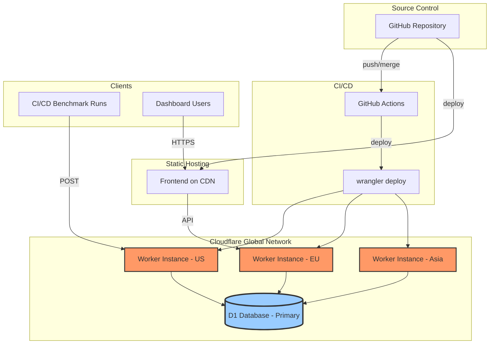
```mermaid
graph TB
    subgraph "Source Control"
        GH[GitHub Repository]
    end

    subgraph "CI/CD"
        GHA[GitHub Actions]
        WD[wrangler deploy]
    end

    subgraph "Cloudflare Global Network"
        CF1[Worker Instance - US]
        CF2[Worker Instance - EU]
        CF3[Worker Instance - Asia]
        D1[(D1 Database - Primary)]
    end

    subgraph "Static Hosting"
        CDN[Frontend on CDN]
    end

    subgraph "Clients"
        CLI[CI/CD Benchmark Runs]
        USERS[Dashboard Users]
    end

    GH -->|push/merge| GHA
    GHA -->|deploy| WD
    WD --> CF1
    WD --> CF2
    WD --> CF3
    CF1 --> D1
    CF2 --> D1
    CF3 --> D1

    GH -->|deploy| CDN

    CLI -->|POST| CF1
    USERS -->|HTTPS| CDN
    CDN -->|API| CF2

    style D1 fill:#9cf,stroke:#333,stroke-width:3px
    style CF1 fill:#f96,stroke:#333,stroke-width:2px
    style CF2 fill:#f96,stroke:#333,stroke-width:2px
    style CF3 fill:#f96,stroke:#333,stroke-width:2px
```

### Deployment Steps

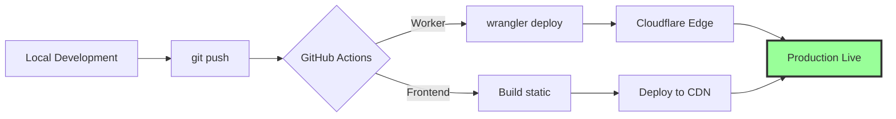
```mermaid
graph LR
    A[Local Development] --> B[git push]
    B --> C{GitHub Actions}

    C -->|Worker| D[wrangler deploy]
    D --> E[Cloudflare Edge]

    C -->|Frontend| F[Build static]
    F --> G[Deploy to CDN]

    E --> H[Production Live]
    G --> H

    style H fill:#9f9,stroke:#333,stroke-width:3px
```

**Worker Deployment**:
```bash
cd worker
wrangler d1 create ze-benchmarks
wrangler d1 migrations apply ze-benchmarks --remote
wrangler secret put API_SECRET_KEY
wrangler deploy
```

**Frontend Deployment**:
```bash
cd benchmark-report
VITE_API_URL=https://your-worker.workers.dev pnpm build
# Deploy dist/ to Vercel/Netlify/Cloudflare Pages
```

**GitHub Secrets Required**:
- `ZE_BENCHMARKS_WORKER_URL`: Production Worker URL
- `ZE_BENCHMARKS_API_KEY`: Matches Worker's API_SECRET_KEY
- `ANTHROPIC_API_KEY`: For running benchmarks
- `OPENROUTER_API_KEY`: For running benchmarks

---

## Technology Stack

### Complete Stack Diagram

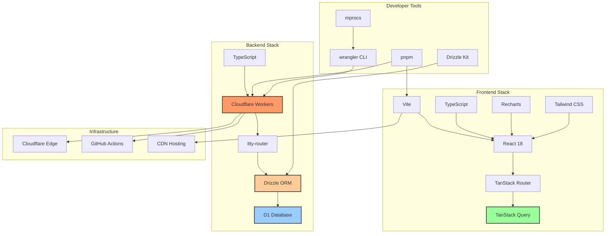
```mermaid
graph TB
    subgraph "Frontend Stack"
        F1[React 18]
        F2[TanStack Router]
        F3[TanStack Query]
        F4[Vite]
        F5[TypeScript]
        F6[Recharts]
        F7[Tailwind CSS]
    end

    subgraph "Backend Stack"
        B1[Cloudflare Workers]
        B2[itty-router]
        B3[Drizzle ORM]
        B4[D1 Database]
        B5[TypeScript]
    end

    subgraph "Developer Tools"
        D1[pnpm]
        D2[mprocs]
        D3[wrangler CLI]
        D4[Drizzle Kit]
    end

    subgraph "Infrastructure"
        I1[Cloudflare Edge]
        I2[GitHub Actions]
        I3[CDN Hosting]
    end

    F1 --> F2
    F2 --> F3
    F4 --> F1
    F5 --> F1
    F6 --> F1
    F7 --> F1

    B1 --> B2
    B2 --> B3
    B3 --> B4
    B5 --> B1

    D1 --> F4
    D1 --> B1
    D2 --> D3
    D3 --> B1
    D4 --> B3

    B1 --> I1
    B1 --> I2
    F4 --> I3

    style B1 fill:#f96,stroke:#333,stroke-width:2px
    style B3 fill:#fc9,stroke:#333,stroke-width:2px
    style B4 fill:#9cf,stroke:#333,stroke-width:2px
    style F3 fill:#9f9,stroke:#333,stroke-width:2px
```

### Technology Choices & Rationale

| Technology | Purpose | Why Chosen |
|------------|---------|------------|
| **Cloudflare Workers** | Serverless API runtime | Global edge deployment, instant cold starts, generous free tier |
| **D1 Database** | SQLite-compatible serverless DB | Integrated with Workers, familiar SQL syntax, zero-config replication |
| **Drizzle ORM** | Type-safe database queries | Best TypeScript support, zero runtime overhead, SQL-like API |
| **itty-router** | HTTP routing | Tiny bundle size (< 1KB), perfect for Workers environment |
| **TanStack Query** | Server state management | Industry-standard, built-in caching, optimistic updates, DevTools |
| **TanStack Router** | Client-side routing | Type-safe routes, file-based routing, modern React patterns |
| **Vite** | Build tool | Fast HMR, optimized builds, great DX |
| **mprocs** | Process orchestration | Simple YAML config, terminal UI, easy process management |
| **pnpm** | Package manager | Fast, efficient, workspace support |

---

## Key Architectural Decisions

### 1. Why Cloudflare Workers over traditional servers?

**Decision**: Use Cloudflare Workers instead of Express/Fastify server

**Rationale**:
- Zero cold starts (Workers are instantiated on-demand)
- Global edge deployment (low latency worldwide)
- Free tier is more than sufficient (100k requests/day)
- Integrated with D1 database
- No server management or ops overhead

### 2. Why Drizzle ORM over Prisma?

**Decision**: Use Drizzle ORM instead of Prisma

**Rationale**:
- Zero runtime dependencies (Prisma has large engine)
- Better TypeScript inference
- SQL-like query syntax (easier for SQL experts)
- Smaller bundle size (critical for Workers)
- Direct D1 support

### 3. Why TanStack Query over Redux/Zustand?

**Decision**: Use TanStack Query instead of global state managers

**Rationale**:
- Server state is fundamentally different from client state
- Built-in caching, refetching, and synchronization
- Automatic background updates
- DevTools for debugging
- Industry standard with great documentation

### 4. Why unified architecture for local and production?

**Decision**: Use same Worker + D1 architecture locally and in production

**Rationale**:
- Test the real thing during development
- No environment-specific bugs
- Simplified CI/CD (same code paths)
- Consistent developer experience

### 5. Why mprocs over docker-compose?

**Decision**: Use mprocs instead of Docker

**Rationale**:
- No Docker overhead or installation complexity
- Native process execution (faster startup)
- Simple YAML configuration
- Interactive terminal UI
- Better suited for Wrangler dev server

---

## Migration Path

### Migration Checklist

This system migrated from file-based to API-driven architecture:

- [x] Create Worker directory structure
- [x] Implement Drizzle ORM schema
- [x] Build API endpoints (runs, batches, stats, submit)
- [x] Add middleware (CORS, auth, error handling)
- [x] Create BenchmarkLogger that POSTs to Worker
- [x] Update frontend to use TanStack Query
- [x] Remove sql.js dependency
- [x] Add API client with TypeScript types
- [x] Create mprocs configuration
- [x] Update documentation
- [x] Test local development flow
- [x] Configure GitHub Actions for deployment

### Breaking Changes

**For CLI Users**:
- Must set `ZE_BENCHMARKS_WORKER_URL` environment variable
- Must set `ZE_BENCHMARKS_API_KEY` environment variable
- Old database query methods now throw errors

**For Frontend**:
- No longer loads local SQLite file
- Requires Worker API to be running
- Must set `VITE_API_URL` environment variable

### Backward Compatibility

The old SQLite-based logger remains in the codebase (`packages/database/src/logger.ts`) but its query methods throw errors directing users to the Worker API.

---

## Performance Characteristics

### Latency Profile

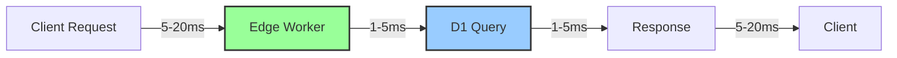
```mermaid
graph LR
    A[Client Request] -->|5-20ms| B[Edge Worker]
    B -->|1-5ms| C[D1 Query]
    C -->|1-5ms| D[Response]
    D -->|5-20ms| E[Client]

    style B fill:#9f9,stroke:#333,stroke-width:2px
    style C fill:#9cf,stroke:#333,stroke-width:2px
```

**Expected Latencies**:
- Worker invocation: < 1ms (already running)
- D1 query (simple): 1-5ms
- D1 query (complex aggregation): 5-20ms
- Total roundtrip: 10-50ms depending on location

### Scalability

**Cloudflare Workers**:
- Automatically scales to handle traffic
- No configuration required
- Distributed globally across 200+ data centers

**D1 Database**:
- 5 million rows read/day (free tier)
- 5 GB storage (free tier)
- Sufficient for 1000s of benchmark runs/day

### Caching Strategy

**Frontend**:
- TanStack Query cache: 30-60 seconds stale time
- Automatic background refetching
- Manual refresh capability

**Worker**:
- No server-side caching (Cloudflare handles edge caching)
- D1 has internal query optimization

---

## Security Considerations

### Authentication

**API Key Security**:
- Stored in Cloudflare Worker secrets (encrypted at rest)
- Never committed to source control
- Passed as Bearer token in Authorization header
- Simple string comparison (no complex JWT infrastructure)

**CORS Configuration**:
- Allow all origins (`*`) for public read endpoints
- No credentials required for GET endpoints
- Preflight requests handled automatically

### Data Security

- D1 database encrypted at rest
- TLS/HTTPS for all communications
- No sensitive data stored (benchmark results are non-sensitive)
- Worker runs in isolated execution environment

---

## Monitoring & Observability

### Available Metrics

**Cloudflare Dashboard**:
- Request count
- Error rate
- Response time (p50, p95, p99)
- Worker CPU time
- D1 query count

**Frontend DevTools**:
- TanStack Query DevTools for cache inspection
- Network tab for API call monitoring
- Console for error tracking

### Error Handling

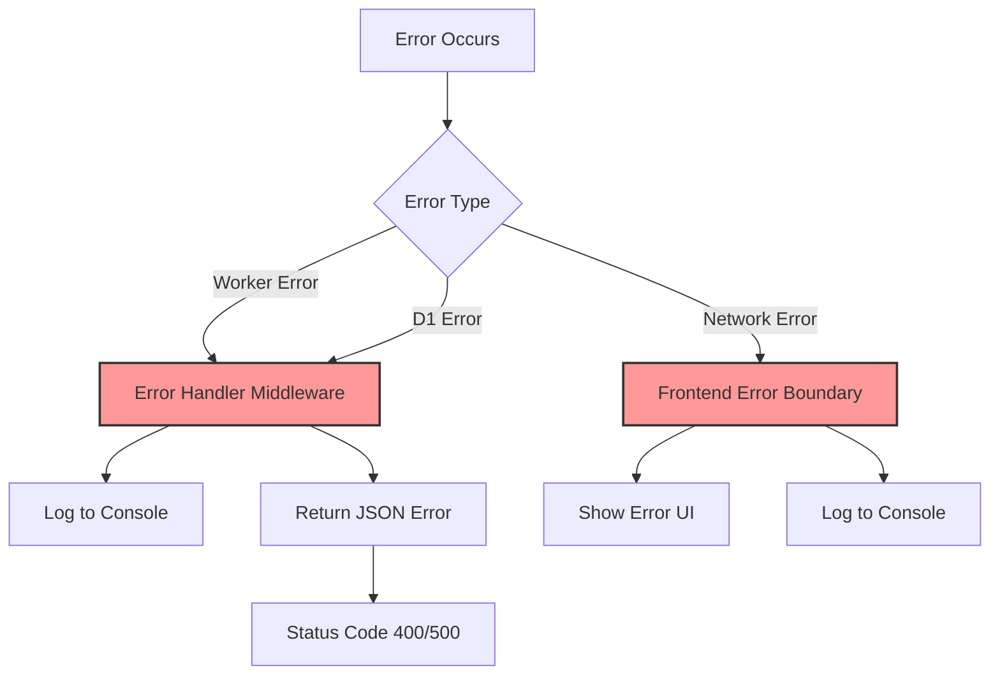
```mermaid
graph TB
    A[Error Occurs] --> B{Error Type}
    B -->|Worker Error| C[Error Handler Middleware]
    B -->|D1 Error| C
    B -->|Network Error| D[Frontend Error Boundary]

    C --> E[Log to Console]
    C --> F[Return JSON Error]
    F --> G[Status Code 400/500]

    D --> H[Show Error UI]
    D --> I[Log to Console]

    style C fill:#f99,stroke:#333,stroke-width:2px
    style D fill:#f99,stroke:#333,stroke-width:2px
```

---

## Future Enhancements

### Potential Improvements

1. **Real-time Updates**: WebSocket support for live dashboard updates
2. **Advanced Analytics**: Time-series analysis, trend detection
3. **Batch Management UI**: Create and manage batches from frontend
4. **API Documentation**: Auto-generated OpenAPI spec
5. **Rate Limiting**: Protect against abuse
6. **Webhooks**: Notify external systems on benchmark completion
7. **Export Functionality**: CSV/JSON export of benchmark results
8. **Comparison Tools**: Side-by-side benchmark comparison
9. **Historical Trends**: Long-term performance tracking
10. **Multi-tenancy**: Support for multiple organizations

---

## Conclusion

This architecture transformation represents a significant modernization of the ze-benchmarks system:

**From**: File-based, browser-loaded SQLite
**To**: API-driven, edge-deployed, serverless architecture

**Key Achievements**:
- ✅ Unified local and production environments
- ✅ Real-time data flow via HTTP
- ✅ Type-safe end-to-end TypeScript
- ✅ Zero-cost infrastructure
- ✅ Scalable and globally distributed
- ✅ Excellent developer experience

The new architecture provides a solid foundation for future enhancements while maintaining simplicity and ease of use.

---

## Worker Development Guide

This section provides comprehensive guides for working with the Cloudflare Worker and D1 database.

### Starting the Worker Server

#### Quick Start

**Local D1 (default):**
```bash
cd worker
pnpm dev
```

This starts the Worker on **http://localhost:8787** using **local D1 database**.

**Remote D1 (Cloudflare):**
```bash
cd worker
pnpm dev:remote
```

This starts the Worker on **http://localhost:8787** but connects to **remote D1 database** on Cloudflare.

**Start Everything (Worker + Frontend):**
```bash
# From root directory
pnpm dev
```

This starts:
- **Worker** on `http://localhost:8787`
- **Frontend** on `http://localhost:3000`

#### Production Deployment

To deploy the Worker to Cloudflare:

```bash
cd worker
pnpm run deploy
```

**Note:** Use `pnpm run deploy` (not `pnpm deploy`) because `deploy` is a script, not a workspace command.

This will give you a URL like:
- `https://ze-benchmarks-api.your-subdomain.workers.dev`

#### Verify Server is Running

**Check Local Worker:**
```bash
curl http://localhost:8787/health
```

Should return:
```json
{"status":"ok","timestamp":"2025-11-11T00:00:00.000Z"}
```

**Check Remote Worker:**
```bash
curl https://your-worker.workers.dev/health
```

### Local vs Remote D1 in Development

When running `wrangler dev`, you can choose to use either **local D1** or **remote D1** (Cloudflare).

| Command | D1 Database | Use Case |
|---------|-------------|----------|
| `pnpm dev` | **Local D1** | Fast development, no Cloudflare needed |
| `pnpm dev:remote` | **Remote D1** | Test against production database |

#### Local D1 (Default)

**What happens:**
- Worker runs on `http://localhost:8787`
- Uses **local D1 database** (stored in `.wrangler/state/v3/d1/`)
- Fast startup, no network calls
- Data is stored locally on your machine
- Good for: Development, testing, prototyping

**Output shows:**
```
env.DB (ze-benchmarks)               D1 Database               local
```

#### Remote D1 (Cloudflare)

**What happens:**
- Worker runs on `http://localhost:8787` (still localhost)
- Connects to **remote D1 database** on Cloudflare
- Slower startup (needs to connect to Cloudflare)
- Data is stored in Cloudflare
- Good for: Testing against production data, debugging production issues

**Output shows:**
```
env.DB (ze-benchmarks)               D1 Database               remote
```

#### When to Use Each

**Use Local D1 (`pnpm dev`) when:**
- ✅ Developing new features
- ✅ Testing locally
- ✅ Don't need production data
- ✅ Want fast iteration
- ✅ Working offline

**Use Remote D1 (`pnpm dev:remote`) when:**
- ✅ Testing against production database
- ✅ Debugging production issues
- ✅ Need to see real data
- ✅ Testing migrations on remote database
- ✅ Verifying remote database connectivity

#### Configuration

Make sure your `wrangler.toml` has:
```toml
[[ d1_databases ]]
binding = "DB"
database_name = "ze-benchmarks"
database_id = "your-database-id"  # Required for remote
preview_database_id = "your-preview-database-id"  # For dev:remote
```

**Note:** For remote D1, you need a valid `database_id` in `wrangler.toml`. For `dev:remote`, use `preview_database_id` to avoid affecting production.

### Database Setup

#### Issue: "Couldn't find a D1 DB" Error

If you see this error when running `pnpm db:push:local`:

```
✘ [ERROR] Couldn't find a D1 DB with the name or binding 'ze-benchmarks' in your wrangler.toml file.
```

This means the local D1 database hasn't been initialized yet.

#### Solution

**Option 1: Initialize with wrangler dev (Recommended)**

Local D1 databases are automatically created when you run `wrangler dev`.

1. **Start the worker** (this initializes the local D1 database):
   ```bash
   cd worker
   pnpm dev
   ```
   Let it run for a few seconds, then stop it (Ctrl+C).

2. **Now run the migration:**
   ```bash
   pnpm db:push:local
   ```

**Option 2: Use Wrangler Auto-Migrations**

Wrangler can auto-apply migrations when you run `wrangler dev` if `migrations_dir` is set in `wrangler.toml` (which it is).

1. **Just run the worker:**
   ```bash
   cd worker
   pnpm dev
   ```

2. Wrangler will automatically apply migrations from the `drizzle/` folder.

**Option 3: Create Remote Database**

If you need a remote database:

1. **Create the D1 database** (requires Cloudflare account):
   ```bash
   cd worker
   wrangler d1 create ze-benchmarks
   ```

2. **Copy the database_id** from the output and update `wrangler.toml`:
   ```toml
   database_id = "your-database-id-here"
   ```

3. **Apply migrations to remote:**
   ```bash
   pnpm db:push:remote
   ```

#### Check Database State

Before applying migrations, check if tables already exist:

```bash
cd worker
# Check local database
pnpm db:check

# Check remote database
pnpm db:check:remote
```

#### Error: "table already exists"

If you see this error:
```
✘ [ERROR] table `batch_runs` already exists
```

This means the migration was already applied. You can:
1. **Skip the migration** - Tables already exist, no action needed
2. **Check database state** - Run `pnpm db:check` or `pnpm db:check:remote` to verify
3. **Use Wrangler auto-migrations** - If `migrations_dir` is set, Wrangler tracks applied migrations

### Drizzle Commands Explained

#### `db:generate` → `drizzle-kit generate`

**What it does:**
- Reads your TypeScript schema from `src/db/schema.ts`
- Compares it with existing migrations
- Generates new migration SQL files in `drizzle/` folder
- Creates files like `0000_quiet_turbo.sql`, `0001_something.sql`, etc.

**When to use:**
- After modifying `src/db/schema.ts`
- Before applying schema changes to database
- Creates migration history for version control

**Example:**
```bash
# 1. Edit src/db/schema.ts (add a new column, table, etc.)
# 2. Generate migration file
pnpm db:generate
# 3. Review the generated SQL in drizzle/0001_*.sql
# 4. Apply it with db:push:local or db:push:remote
```

#### `db:push:local` → `wrangler d1 execute ze-benchmarks --local --file=./drizzle/0000_quiet_turbo.sql`

**What it does:**
- Manually executes a SQL migration file
- Applies it to your **local D1 database** (used by `wrangler dev`)
- Uses Wrangler CLI to execute SQL directly

**When to use:**
- After generating migrations with `db:generate`
- To set up local database schema
- When you need to manually apply a specific migration file

**Note:** This executes a specific file. If you have multiple migrations, you need to run them in order.

#### `db:push:remote` → `wrangler d1 execute ze-benchmarks --remote --file=./drizzle/0000_quiet_turbo.sql`

**What it does:**
- Same as `db:push:local`, but for **remote/production D1 database**
- Applies migrations to your Cloudflare D1 database in the cloud

**When to use:**
- After testing migrations locally
- To update production database schema
- **⚠️ Be careful** - this modifies production data!

#### Wrangler Auto-Migrations

When `migrations_dir = "drizzle"` is set in `wrangler.toml`:
- Wrangler **automatically applies migrations** when you run `wrangler dev`
- Migrations are applied in order based on timestamp
- You may still need to run `db:push:local` manually for a fresh database

#### Summary

| Command | Purpose | Creates Files? | Applies to DB? |
|---------|---------|----------------|----------------|
| `db:generate` | Generate migration files | ✅ Yes | ❌ No |
| `db:push:local` | Apply migrations (local) | ❌ No | ✅ Yes |
| `db:push:remote` | Apply migrations (remote) | ❌ No | ✅ Yes |

**For this project:** Use `db:generate` + `db:push:local/remote` for migration-based workflow.

### Common Issues

#### "Port 8787 already in use"
```bash
# Find and kill the process
lsof -ti:8787 | xargs kill -9
# Then start again
cd worker && pnpm dev
```

#### "Database not found"
```bash
# Initialize local D1 first
cd worker
pnpm dev  # This auto-initializes local D1
# Or manually apply migrations
pnpm db:push:local
```

#### "Cannot connect to Worker"
- Make sure Worker is running: `pnpm dev` in worker directory
- Check the URL: Should be `http://localhost:8787` for local
- Verify with: `curl http://localhost:8787/health`

#### "Database not found" with remote
- Make sure `database_id` is set in `wrangler.toml`
- Verify the database exists: `wrangler d1 list`
- Check you're authenticated: `wrangler whoami`

#### "Cannot connect to remote D1"
- Check your internet connection
- Verify Cloudflare authentication: `wrangler login`
- Make sure the database exists in your Cloudflare account

---

## Performance Bottlenecks

This section identifies where speed bottlenecks occur when running benchmarks and provides optimization strategies.

### Benchmark Execution Flow

A single benchmark run goes through 6 stages:

```
Stage 1: Setup (fast) → Stage 2: Workspace (medium) → Stage 3: Agent (SLOW) 
→ Stage 4: Validation (SLOW) → Stage 5: Evaluation (medium) → Stage 6: Results (fast)
```

### Bottleneck Analysis

#### 🔴 **CRITICAL BOTTLENECK #1: Agent API Calls (Stage 3)**

**Location**: `packages/harness/src/cli.ts:2315` - `await agentAdapter.send(request)`

**Why it's slow:**
- **Multi-turn conversations**: Agents can make 10-50 turns (iterations)
- **Sequential API calls**: Each turn waits for LLM response before next turn
- **Tool execution between turns**: Tools (readFile, writeFile, runCommand) execute synchronously
- **Network latency**: Round-trip time to LLM API (Anthropic, OpenRouter, etc.)
- **Token generation time**: LLM needs time to generate responses
- **No parallelization**: All tool calls within a turn are sequential

**Typical Time Breakdown:**
- **Per API call**: 2-10 seconds (network + generation)
- **Per tool call**: 0.1-5 seconds (file I/O, command execution)
- **Total agent time**: 30 seconds - 10+ minutes (depending on complexity)

**Optimization Opportunities:**
1. ✅ **Parallel tool execution** - Execute independent tools in parallel
2. ✅ **Streaming responses** - Start processing while LLM is still generating
3. ✅ **Caching** - Cache file reads and command outputs
4. ✅ **Batch tool calls** - Send multiple tool calls in one API request (if supported)
5. ⚠️ **Reduce max iterations** - Lower from 50 to 20-30 for faster failures

#### 🔴 **CRITICAL BOTTLENECK #2: Validation Commands (Stage 4)**

**Location**: `packages/harness/src/runtime/validation.ts:14` - `runValidationCommands()`

**Why it's slow:**
- **Sequential execution**: Commands run one after another (install → test → lint → typecheck)
- **Blocking operations**: Uses `spawnSync` (synchronous, blocking)
- **Long-running commands**: 
  - `pnpm install`: 30 seconds - 5 minutes (depends on dependencies)
  - `pnpm test`: 10 seconds - 10+ minutes (depends on test suite)
  - `pnpm lint`: 5-30 seconds
  - `pnpm typecheck`: 10-60 seconds
- **No parallelization**: Can't run test/lint/typecheck in parallel
- **10-minute timeout per command**: Can wait up to 10 minutes per command

**Typical Time Breakdown:**
- **Install**: 30s - 5min (most variable)
- **Test**: 10s - 10min (depends on test suite size)
- **Lint**: 5-30s
- **Typecheck**: 10-60s
- **Total validation time**: 1-15+ minutes

**Current Implementation:**
```typescript
// Sequential execution - each waits for previous to finish
for (const kind of order) {  // ['install', 'test', 'lint', 'typecheck']
  const proc = spawnSync(cmd, { ... });  // BLOCKING
  // Wait for completion before next command
}
```

**Optimization Opportunities:**
1. ✅ **Parallel execution** - Run test/lint/typecheck in parallel (after install)
2. ✅ **Async execution** - Use `spawn` instead of `spawnSync` for non-blocking
3. ✅ **Skip unnecessary commands** - Skip lint/typecheck if test fails
4. ✅ **Caching** - Cache install results if dependencies haven't changed
5. ✅ **Early termination** - Stop on first failure (optional flag)

#### 🟡 **MODERATE BOTTLENECK #3: Workspace Preparation (Stage 2)**

**Location**: `packages/harness/src/cli.ts:2169` - `prepareWorkspaceFromFixture()`

**Why it can be slow:**
- **File copying**: `cpSync` copies entire repo fixture to workspace
- **Large repositories**: Can have thousands of files (node_modules, etc.)
- **Synchronous operation**: Blocks until copy completes
- **Disk I/O**: Limited by disk speed

**Typical Time:**
- **Small repo** (< 100 files): < 1 second
- **Medium repo** (100-1000 files): 1-5 seconds
- **Large repo** (> 1000 files): 5-30 seconds

**Optimization Opportunities:**
1. ✅ **Async copying** - Use async file operations
2. ✅ **Selective copying** - Skip node_modules, .git, etc. (already done with filter)
3. ✅ **Hard links** - Use hard links instead of copying (faster)
4. ✅ **Parallel copying** - Copy multiple directories in parallel

#### 🟡 **MODERATE BOTTLENECK #4: Tool Execution Within Agent Turns**

**Location**: `packages/harness/src/runtime/workspace-tools.ts` - Tool handlers

**Why it can be slow:**
- **Sequential execution**: Tools execute one after another
- **Command execution**: `runCommand` tool spawns shell commands synchronously
- **File I/O**: Multiple readFile/writeFile operations
- **No caching**: Same file might be read multiple times

**Typical Time per Tool:**
- **readFile**: 0.01-0.1 seconds
- **writeFile**: 0.01-0.1 seconds
- **runCommand**: 0.5-30 seconds (depends on command)
- **listFiles**: 0.1-1 second (for large directories)

**Optimization Opportunities:**
1. ✅ **Parallel tool execution** - Execute independent tools concurrently
2. ✅ **Caching** - Cache file reads and command outputs
3. ✅ **Async commands** - Use async spawn for non-blocking execution
4. ✅ **Batch operations** - Combine multiple file operations

#### 🟢 **MINOR BOTTLENECK #5: Evaluator Execution (Stage 5)**

**Location**: `packages/harness/src/cli.ts:2383` - `runEvaluators()`

**Why it can be slow:**
- **Multiple evaluators**: Run sequentially
- **Some evaluators run commands**: PackageManagerEvaluator, DependencyTargetsEvaluator
- **File system operations**: Reading package.json files, parsing

**Typical Time:**
- **Most evaluators**: < 1 second
- **Command-based evaluators**: 1-5 seconds
- **Total evaluation time**: 1-10 seconds

**Optimization Opportunities:**
1. ✅ **Parallel evaluators** - Run independent evaluators in parallel
2. ✅ **Caching** - Cache evaluator results

#### 🟢 **MINOR BOTTLENECK #6: Database Writes**

**Location**: `packages/database/src/logger.ts` - `BenchmarkLogger` methods

**Why it's usually fast:**
- **SQLite**: Very fast for writes
- **Direct writes**: No network overhead
- **Batch operations**: Multiple writes in single transaction

**Typical Time:**
- **Single write**: < 10ms
- **Batch writes**: < 50ms

**Not a significant bottleneck** - Database operations are fast.

### Overall Time Breakdown (Typical Benchmark)

| Stage | Time | % of Total | Bottleneck Level |
|-------|------|------------|------------------|
| **Stage 1: Setup** | 0.1-1s | < 1% | 🟢 None |
| **Stage 2: Workspace** | 1-30s | 1-5% | 🟡 Moderate |
| **Stage 3: Agent** | 30s-10min | **60-80%** | 🔴 **CRITICAL** |
| **Stage 4: Validation** | 1-15min | **15-30%** | 🔴 **CRITICAL** |
| **Stage 5: Evaluation** | 1-10s | 1-2% | 🟡 Moderate |
| **Stage 6: Results** | 0.1-1s | < 1% | 🟢 None |
| **Total** | **2-25 minutes** | 100% | |

### Parallel Execution

#### Current State

**Multiple benchmarks** can run in parallel:
- Enabled when 3+ benchmarks are queued
- Concurrency: 2-8 benchmarks (based on total count)
- Each benchmark still runs its stages sequentially

**Within a single benchmark**, stages are **sequential**:
- Agent turns are sequential
- Validation commands are sequential
- Tool calls are sequential

#### Optimization Potential

**If we parallelize within benchmarks:**
- **Agent tool calls**: Could save 20-40% of agent time
- **Validation commands**: Could save 50-70% of validation time (test/lint/typecheck in parallel)
- **Overall**: Could reduce total time by 30-50%

### Optimization Recommendations

#### Quick Wins (Easy to Implement)

1. **Parallel validation commands** (after install):
   ```typescript
   // Run test, lint, typecheck in parallel
   await Promise.all([
     runCommand('test'),
     runCommand('lint'),
     runCommand('typecheck')
   ]);
   ```
   **Expected savings**: 30-50% of validation time

2. **Early termination on validation failure**:
   ```typescript
   if (installFailed) return; // Skip test/lint/typecheck
   ```
   **Expected savings**: 5-10 minutes on failures

3. **Reduce max agent iterations**:
   ```typescript
   DEFAULT_MAX_ITERATIONS = 20; // Instead of 50
   ```
   **Expected savings**: Faster failure detection

#### Medium Effort (Moderate Impact)

4. **Parallel tool execution** (within agent turns):
   ```typescript
   // Execute independent tools concurrently
   await Promise.all(toolCalls.map(executeTool));
   ```
   **Expected savings**: 20-40% of agent time

5. **Async validation commands**:
   ```typescript
   // Use spawn instead of spawnSync
   const proc = spawn(cmd, { ... });
   await new Promise((resolve) => proc.on('close', resolve));
   ```
   **Expected savings**: Better progress tracking, can cancel

6. **Caching file reads**:
   ```typescript
   const fileCache = new Map();
   if (fileCache.has(path)) return fileCache.get(path);
   ```
   **Expected savings**: 10-20% of tool execution time

#### High Effort (High Impact)

7. **Streaming agent responses**:
   - Process tool calls as they arrive
   - Start executing tools while LLM is still generating
   **Expected savings**: 30-50% of agent time

8. **Smart caching**:
   - Cache install results if package.json unchanged
   - Cache test results if code unchanged
   **Expected savings**: 50-80% on repeated runs

9. **Distributed execution**:
   - Run validation on separate workers
   - Run multiple agent turns in parallel (if possible)
   **Expected savings**: 60-80% with proper parallelization

### Summary

**Primary Bottlenecks:**
1. 🔴 **Agent API calls** (60-80% of time) - Multi-turn conversations, sequential tool execution
2. 🔴 **Validation commands** (15-30% of time) - Sequential install/test/lint/typecheck

**Secondary Bottlenecks:**
3. 🟡 **Workspace preparation** (1-5% of time) - File copying
4. 🟡 **Tool execution** (within agent turns) - Sequential tool calls

**Quick Wins:**
- Parallel validation commands: **30-50% time savings**
- Early termination: **5-10 minutes on failures**
- Reduce max iterations: **Faster failure detection**

**Best Overall Optimization:**
- Parallel validation commands + parallel tool execution = **40-60% total time reduction**
