# ze-benchmarks Architecture Documentation

## Table of Contents
1. [Overview](#overview)
2. [Architecture Transformation](#architecture-transformation)
3. [System Architecture](#system-architecture)
4. [Data Flow](#data-flow)
5. [Component Details](#component-details)
6. [Database Schema](#database-schema)
7. [API Architecture](#api-architecture)
8. [Local Development](#local-development)
9. [Production Deployment](#production-deployment)
10. [Technology Stack](#technology-stack)

---

## Overview

The ze-benchmarks system is a comprehensive benchmark harness and reporting platform for evaluating AI agent performance. The system recently underwent a major architectural transformation from a file-based architecture to a distributed, API-driven architecture using Cloudflare Workers and D1 database.

### Key Goals of the Rewrite

- **Unified Architecture**: Same code path for local development and production
- **Real-time Updates**: Eliminate file sync issues with HTTP-based data flow
- **Scalability**: Edge-deployed serverless architecture
- **Type Safety**: End-to-end TypeScript with Drizzle ORM
- **Developer Experience**: Single-command startup with mprocs
- **Zero Cost**: Runs entirely on Cloudflare's free tier

---

## Architecture Transformation

### Before: File-Based Architecture


**Problems with Old Architecture:**
- File locking issues with concurrent writes
- Large SQLite file served to browser (poor performance)
- No real-time updates without page refresh
- sql.js overhead in browser
- Difficult to query and analyze data
- No API for external integrations

### After: API-Driven Architecture


**Benefits of New Architecture:**
- Real-time data flow via HTTP
- Edge-deployed for global performance
- Type-safe queries with Drizzle ORM
- Efficient caching with TanStack Query
- RESTful API for any client
- Scalable serverless infrastructure

---

## System Architecture

### High-Level Component View


### Architecture Layers


---

## Data Flow

### Complete Benchmark Run Flow


### Local Development Data Flow


### Production Data Flow


---

## Component Details

### 1. Cloudflare Worker API

**Location**: `worker/src/`


**Key Files**:
- `index.ts`: Main entry point, router configuration
- `api/runs.ts`: Run queries (list, details, evaluations, telemetry)
- `api/batches.ts`: Batch operations and analytics
- `api/stats.ts`: Statistics and aggregations
- `api/submit.ts`: Result submission endpoints (authenticated)
- `db/schema.ts`: Drizzle ORM schema definitions
- `middleware/`: CORS, authentication, error handling

**Responsibilities**:
- Route HTTP requests to appropriate handlers
- Validate API authentication for write operations
- Execute type-safe database queries via Drizzle ORM
- Return JSON responses with proper CORS headers
- Handle errors gracefully with detailed messages

### 2. Database Layer (D1 + Drizzle)

**Schema**: `worker/src/db/schema.ts`

The database uses Drizzle ORM for type-safe queries against Cloudflare D1 (SQLite-compatible).

**Tables**:
1. `batch_runs`: Batch-level aggregations
2. `benchmark_runs`: Individual benchmark run records
3. `evaluation_results`: Evaluator scores for each run
4. `run_telemetry`: Token usage, cost, duration metrics

**Indexes** (for query performance):
- Suite + Scenario combination
- Agent lookup
- Status filtering
- Batch ID relationships
- Success flag filtering

### 3. CLI Benchmark Logger

**Location**: `packages/database/src/worker-logger.ts`


**Key Features**:
- Singleton pattern for global access
- In-memory accumulation of run data
- Automatic submission on completion/failure
- Environment-based configuration
- Graceful fallback if Worker URL not configured

### 4. Frontend Architecture

**Location**: `benchmark-report/src/`


**Key Files**:
- `lib/api-client.ts`: Type-safe API client with all endpoints
- `hooks/use-api-queries.ts`: TanStack Query hooks with cache keys
- `DatabaseProvider.tsx`: QueryClient provider (replaces old sql.js provider)
- `routes/index.tsx`: Dashboard with real-time data fetching

**Data Fetching Strategy**:
- TanStack Query for server state management
- 30-second stale time for frequently updated data
- 60-second stale time for stable data (run details)
- Automatic background refetching
- Manual refresh capability
- Client-side aggregations for complex stats

---

## Database Schema

### Entity Relationship Diagram


### Schema Design Principles

1. **Normalization**: Separate tables for runs, evaluations, and telemetry
2. **Batch Grouping**: Aggregate multiple runs into logical batches
3. **Performance Indexes**: Strategic indexes on frequently queried columns
4. **Type Safety**: Drizzle ORM ensures compile-time type checking
5. **Flexibility**: JSON metadata fields for extensibility

---

## API Architecture

### Endpoint Map


### API Request Flow

```mermaid
sequenceDiagram
    participant Client
    participant Worker
    participant CORS
    participant Auth
    participant Handler
    participant Drizzle
    participant D1

    Client->>Worker: HTTP Request
    Worker->>CORS: Check CORS

    alt OPTIONS Request
        CORS-->>Client: CORS Headers
    else GET/POST Request
        CORS->>Auth: Continue

        alt Protected Endpoint
            Auth->>Auth: Validate Bearer Token
            alt Invalid Token
                Auth-->>Client: 401/403 Error
            else Valid Token
                Auth->>Handler: Process Request
            end
        else Public Endpoint
            CORS->>Handler: Process Request
        end

        Handler->>Drizzle: Build Query
        Drizzle->>D1: Execute SQL
        D1-->>Drizzle: Result Set
        Drizzle-->>Handler: Typed Data
        Handler-->>Worker: JSON Response
        Worker-->>Client: Response + CORS
    end
```



### Authentication Flow


**Authentication Details**:
- Bearer token authentication for POST endpoints
- Token stored in Worker secret: `API_SECRET_KEY`
- CLI uses environment variable: `ZE_BENCHMARKS_API_KEY`
- Simple string comparison (no JWT complexity needed)
- Local dev uses `dev-local-key` for convenience

---

## Local Development

### mprocs Orchestration


**mprocs Configuration** (`mprocs.yaml`):
```yaml
procs:
  worker:
    cmd: cd worker && pnpm dev
    autostart: true
  frontend:
    cmd: cd benchmark-report && pnpm dev
    autostart: true
    env:
      VITE_API_URL: http://localhost:8787
```

### Development Workflow


**Commands**:
```bash
# Initial setup
pnpm install
cd worker && pnpm install

# Create local D1 database
cd worker
wrangler d1 create ze-benchmarks
pnpm db:generate
pnpm db:push:local

# Start all services
cd ..
pnpm dev

# In another terminal - run benchmarks
export ZE_BENCHMARKS_WORKER_URL=http://localhost:8787
export ZE_BENCHMARKS_API_KEY=dev-local-key
pnpm bench update-deps nx-pnpm-monorepo L1 anthropic
```

---

## Production Deployment

### Deployment Architecture


### Deployment Steps


**Worker Deployment**:
```bash
cd worker
wrangler d1 create ze-benchmarks
wrangler d1 migrations apply ze-benchmarks --remote
wrangler secret put API_SECRET_KEY
wrangler deploy
```

**Frontend Deployment**:
```bash
cd benchmark-report
VITE_API_URL=https://your-worker.workers.dev pnpm build
# Deploy dist/ to Vercel/Netlify/Cloudflare Pages
```

**GitHub Secrets Required**:
- `ZE_BENCHMARKS_WORKER_URL`: Production Worker URL
- `ZE_BENCHMARKS_API_KEY`: Matches Worker's API_SECRET_KEY
- `ANTHROPIC_API_KEY`: For running benchmarks
- `OPENROUTER_API_KEY`: For running benchmarks

---

## Technology Stack

### Complete Stack Diagram


### Technology Choices & Rationale

| Technology | Purpose | Why Chosen |
|------------|---------|------------|
| **Cloudflare Workers** | Serverless API runtime | Global edge deployment, instant cold starts, generous free tier |
| **D1 Database** | SQLite-compatible serverless DB | Integrated with Workers, familiar SQL syntax, zero-config replication |
| **Drizzle ORM** | Type-safe database queries | Best TypeScript support, zero runtime overhead, SQL-like API |
| **itty-router** | HTTP routing | Tiny bundle size (< 1KB), perfect for Workers environment |
| **TanStack Query** | Server state management | Industry-standard, built-in caching, optimistic updates, DevTools |
| **TanStack Router** | Client-side routing | Type-safe routes, file-based routing, modern React patterns |
| **Vite** | Build tool | Fast HMR, optimized builds, great DX |
| **mprocs** | Process orchestration | Simple YAML config, terminal UI, easy process management |
| **pnpm** | Package manager | Fast, efficient, workspace support |

---

## Key Architectural Decisions

### 1. Why Cloudflare Workers over traditional servers?

**Decision**: Use Cloudflare Workers instead of Express/Fastify server

**Rationale**:
- Zero cold starts (Workers are instantiated on-demand)
- Global edge deployment (low latency worldwide)
- Free tier is more than sufficient (100k requests/day)
- Integrated with D1 database
- No server management or ops overhead

### 2. Why Drizzle ORM over Prisma?

**Decision**: Use Drizzle ORM instead of Prisma

**Rationale**:
- Zero runtime dependencies (Prisma has large engine)
- Better TypeScript inference
- SQL-like query syntax (easier for SQL experts)
- Smaller bundle size (critical for Workers)
- Direct D1 support

### 3. Why TanStack Query over Redux/Zustand?

**Decision**: Use TanStack Query instead of global state managers

**Rationale**:
- Server state is fundamentally different from client state
- Built-in caching, refetching, and synchronization
- Automatic background updates
- DevTools for debugging
- Industry standard with great documentation

### 4. Why unified architecture for local and production?

**Decision**: Use same Worker + D1 architecture locally and in production

**Rationale**:
- Test the real thing during development
- No environment-specific bugs
- Simplified CI/CD (same code paths)
- Consistent developer experience

### 5. Why mprocs over docker-compose?

**Decision**: Use mprocs instead of Docker

**Rationale**:
- No Docker overhead or installation complexity
- Native process execution (faster startup)
- Simple YAML configuration
- Interactive terminal UI
- Better suited for Wrangler dev server

---

## Migration Path

### Migration Checklist

This system migrated from file-based to API-driven architecture:

- [x] Create Worker directory structure
- [x] Implement Drizzle ORM schema
- [x] Build API endpoints (runs, batches, stats, submit)
- [x] Add middleware (CORS, auth, error handling)
- [x] Create BenchmarkLogger that POSTs to Worker
- [x] Update frontend to use TanStack Query
- [x] Remove sql.js dependency
- [x] Add API client with TypeScript types
- [x] Create mprocs configuration
- [x] Update documentation
- [x] Test local development flow
- [x] Configure GitHub Actions for deployment

### Breaking Changes

**For CLI Users**:
- Must set `ZE_BENCHMARKS_WORKER_URL` environment variable
- Must set `ZE_BENCHMARKS_API_KEY` environment variable
- Old database query methods now throw errors

**For Frontend**:
- No longer loads local SQLite file
- Requires Worker API to be running
- Must set `VITE_API_URL` environment variable

### Backward Compatibility

The old SQLite-based logger remains in the codebase (`packages/database/src/logger.ts`) but its query methods throw errors directing users to the Worker API.

---

## Performance Characteristics

### Latency Profile


**Expected Latencies**:
- Worker invocation: < 1ms (already running)
- D1 query (simple): 1-5ms
- D1 query (complex aggregation): 5-20ms
- Total roundtrip: 10-50ms depending on location

### Scalability

**Cloudflare Workers**:
- Automatically scales to handle traffic
- No configuration required
- Distributed globally across 200+ data centers

**D1 Database**:
- 5 million rows read/day (free tier)
- 5 GB storage (free tier)
- Sufficient for 1000s of benchmark runs/day

### Caching Strategy

**Frontend**:
- TanStack Query cache: 30-60 seconds stale time
- Automatic background refetching
- Manual refresh capability

**Worker**:
- No server-side caching (Cloudflare handles edge caching)
- D1 has internal query optimization

---

## Security Considerations

### Authentication

**API Key Security**:
- Stored in Cloudflare Worker secrets (encrypted at rest)
- Never committed to source control
- Passed as Bearer token in Authorization header
- Simple string comparison (no complex JWT infrastructure)

**CORS Configuration**:
- Allow all origins (`*`) for public read endpoints
- No credentials required for GET endpoints
- Preflight requests handled automatically

### Data Security

- D1 database encrypted at rest
- TLS/HTTPS for all communications
- No sensitive data stored (benchmark results are non-sensitive)
- Worker runs in isolated execution environment

---

## Monitoring & Observability

### Available Metrics

**Cloudflare Dashboard**:
- Request count
- Error rate
- Response time (p50, p95, p99)
- Worker CPU time
- D1 query count

**Frontend DevTools**:
- TanStack Query DevTools for cache inspection
- Network tab for API call monitoring
- Console for error tracking

### Error Handling

```mermaid
graph TB
    A[Error Occurs] --> B{Error Type}
    B -->|Worker Error| C[Error Handler Middleware]
    B -->|D1 Error| C
    B -->|Network Error| D[Frontend Error Boundary]

    C --> E[Log to Console]
    C --> F[Return JSON Error]
    F --> G[Status Code 400/500]

    D --> H[Show Error UI]
    D --> I[Log to Console]

    style C fill:#f99,stroke:#333,stroke-width:2px
    style D fill:#f99,stroke:#333,stroke-width:2px
```

---

## Future Enhancements

### Potential Improvements

1. **Real-time Updates**: WebSocket support for live dashboard updates
2. **Advanced Analytics**: Time-series analysis, trend detection
3. **Batch Management UI**: Create and manage batches from frontend
4. **API Documentation**: Auto-generated OpenAPI spec
5. **Rate Limiting**: Protect against abuse
6. **Webhooks**: Notify external systems on benchmark completion
7. **Export Functionality**: CSV/JSON export of benchmark results
8. **Comparison Tools**: Side-by-side benchmark comparison
9. **Historical Trends**: Long-term performance tracking
10. **Multi-tenancy**: Support for multiple organizations

---

## Conclusion

This architecture transformation represents a significant modernization of the ze-benchmarks system:

**From**: File-based, browser-loaded SQLite
**To**: API-driven, edge-deployed, serverless architecture

**Key Achievements**:
- ✅ Unified local and production environments
- ✅ Real-time data flow via HTTP
- ✅ Type-safe end-to-end TypeScript
- ✅ Zero-cost infrastructure
- ✅ Scalable and globally distributed
- ✅ Excellent developer experience

The new architecture provides a solid foundation for future enhancements while maintaining simplicity and ease of use.
